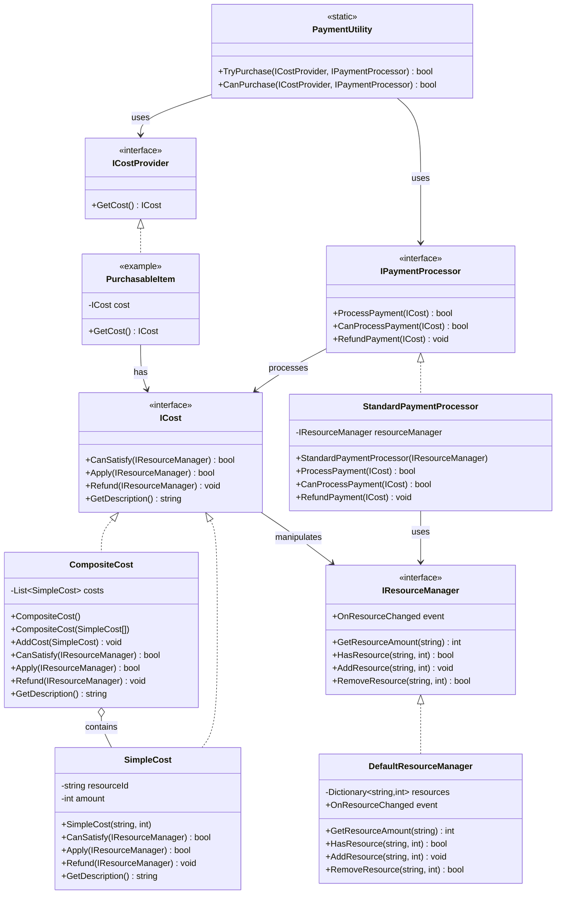
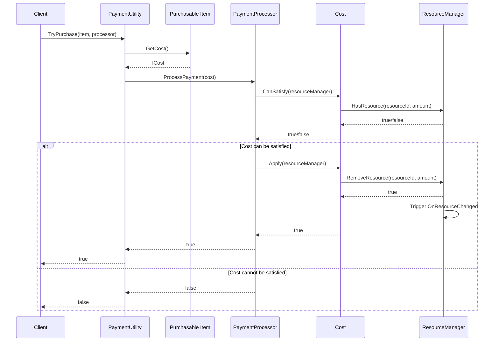
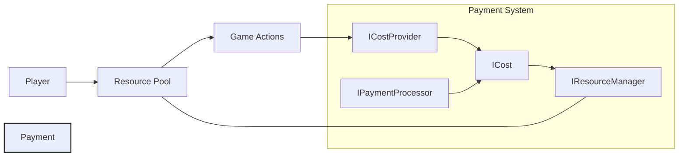
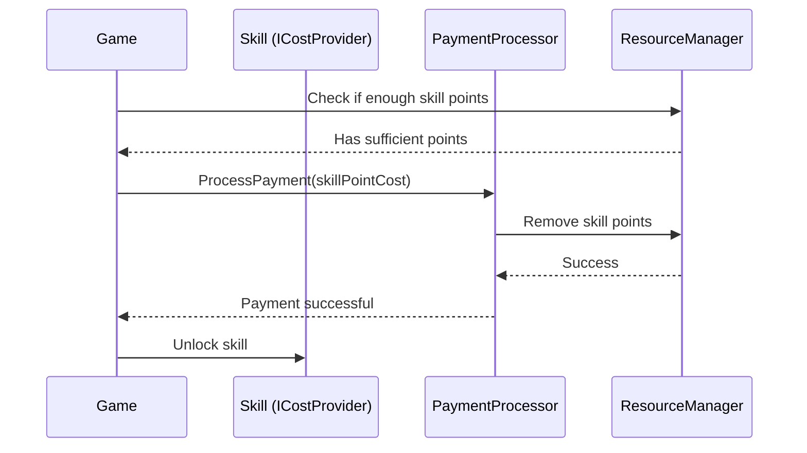
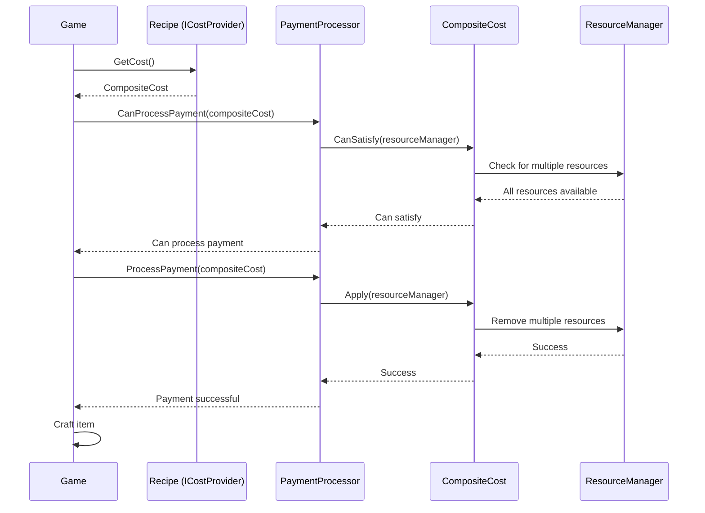

# Payment System Documentation

The Seyren payment system provides a flexible framework for handling in-game resource transactions. This system allows for any kind of resource payment such as gold, skill points, attribute points, and more.

## Component Relationships

## Flow Diagram

## Resource Flow

## Common Usage Patterns

### Simple Resource Payment

### Composite Resource Cost

## Implementation Notes

- The payment system is designed to be flexible and extensible, allowing for any type of in-game resource to be managed.
- Resources are identified by string IDs, making the system easily adaptable to different game requirements.
- The separation of concerns between costs, providers, and processors ensures good software architecture.
- The system supports both simple payments (one resource) and composite payments (multiple resources).
- Refund functionality is available for cases where operations need to be reversed.