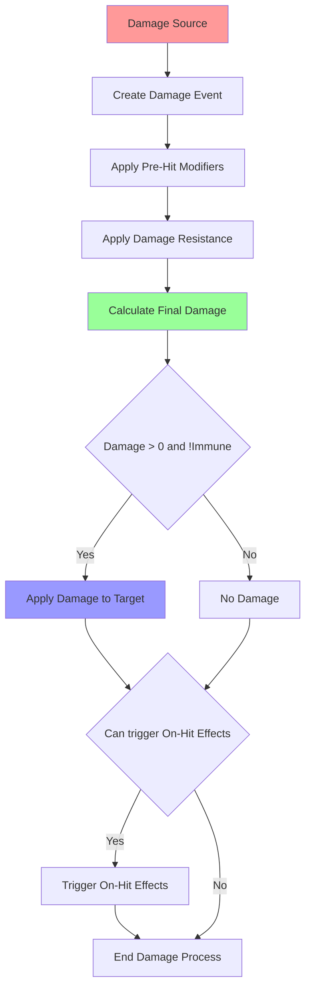

# Damage Engine



# Damage Flow
```mermaid
flowchart LR
    U[Unit] --> A[Do action]
    A --> |Add action to queue| Universe[Universe]
    Universe --> |Process action| Universe
    Universe --> |Completed actions| TriggerEffect[Trigger effect of Action]
    TriggerEffect --> |Deal Damage| DA[Damage Engine]
    DA --> CD[Calculate Damage]
    CD --> |Call method| Damage[target.InflictDamage]

    Damage --> |Call method| Formula
    Formula --> |Calculate effective damage based on armor|
    Damage --> |Trigger Event| Universe

```