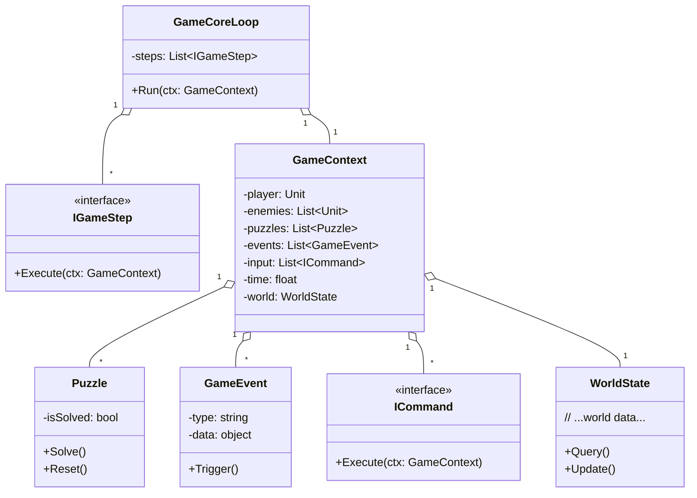
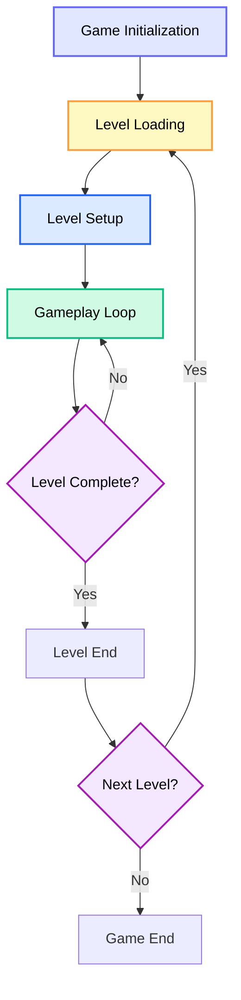
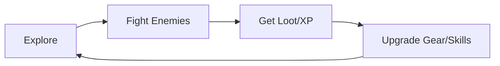
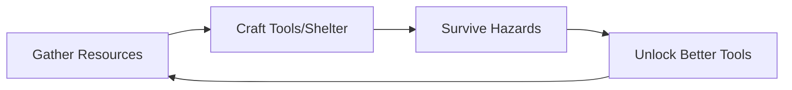
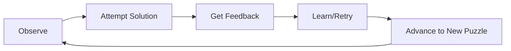

# 🎮 Gameplay Design Baseline (Universal Framework)

## 1. Core Loop
**What the player does repeatedly**

- Define the primary player activities (e.g., explore → fight → loot → upgrade)
- Ensure it is fun on its own, even when repeated
- Make it tight, rewarding, and engaging

> **Example:** In an action RPG → Explore → Fight Enemies → Gain XP → Upgrade Skills → Explore further

---

## 2. Player Goal
**What motivates the player in this level or session**

- Short-term goals: Open door, survive wave, find item
- Long-term goals: Save the world, complete storyline, reach rank X
- Bonus goals: Discover secrets, optional challenges

> Good gameplay always drives players toward something they want to do.

---

## 3. Rules and Boundaries
**What players can and cannot do**

- Define abilities (run, jump, build, cast spells)
- Define limits (can’t pass locked door, stamina drains)
- Set constraints that create meaningful decisions

> Rules turn raw mechanics into actual gameplay.

---

## 4. Feedback System
**How the game responds to actions**

- Visual, audio, and haptic feedback
- UI/UX cues: damage flash, XP popup, sound effects
- World reactions: enemy alertness, environment changes

> Feedback reinforces learning and makes the game world feel alive.

---

## 5. Challenge and Progression
**What pushes the player and how they grow**

- Introduce escalating challenges (new enemies, time limits, puzzles)
- Gradually increase difficulty to maintain tension
- Offer rewards and growth: abilities, tools, narrative, access

> Players enjoy overcoming something.

---

## 6. Choice and Consequence
**Let the player make decisions that matter**

- Strategic choices: What to upgrade, whom to ally with
- Tactical choices: Fight or flee, stealth or attack
- Environmental or narrative consequences: Save or sacrifice

> Good gameplay isn’t just action—it’s agency.

---

## 7. Pacing and Flow
**Balance of intensity, rest, and rhythm**

- Alternate between tension and relief
- Use layout, music, and encounters to create emotional flow
- Avoid fatigue: mix combat, exploration, and story

> Flow = players are fully engaged without being overwhelmed.

---

## 8. Meaningful Rewards
**Why the player keeps playing**

- Progression: XP, gear, access
- Story: Reveals, twists, world-building
- Cosmetic: Skins, styles, achievements
- Utility: Unlocks tools or skills that change how the game is played

> Reward reinforces behavior and deepens investment.

---

## 9. Immersion & Consistency
**The world must make sense and feel believable**

- Mechanics should match the narrative and setting
- Avoid breaking immersion with inconsistent rules or abrupt tone shifts

> Even abstract games benefit from a strong theme or internal logic.

---

## 10. Fail State and Recovery
**What happens when the player fails**

- What constitutes failure? (death, loss of objective, missed event)
- Is there recovery? (restart, checkpoint, retry)
- Does failure teach the player something?

> Failure should be a learning opportunity, not punishment.

---

## Summary Table

| Element                | Purpose                | Key Question                                 |
|------------------------|-----------------------|----------------------------------------------|
| Core Loop              | Repeated fun action   | What does the player do most often?          |
| Player Goal            | Motivation            | Why is the player doing this?                |
| Rules & Boundaries     | Constraints           | What can and can't the player do?            |
| Feedback System        | Responsiveness        | How does the game react to actions?          |
| Challenge & Progression| Engagement & Growth   | How does difficulty and reward evolve?       |
| Choice & Consequence   | Agency                | Are decisions meaningful?                    |
| Pacing & Flow          | Emotional rhythm      | Is the gameplay rhythm smooth and varied?    |
| Meaningful Rewards     | Motivation booster    | What rewards the player's effort?            |
| Immersion & Consistency| Believability         | Does everything feel internally consistent?  |
| Fail State & Recovery  | Risk and learning     | How does failure impact progress?            |

## Class diagram

_This class diagram illustrates a modular gameplay architecture using the Pipeline (Core Loop), Command, and Observer patterns. The `GameCoreLoop` manages a sequence of `IGameStep` objects, each operating on a shared `GameContext`. Systems (Input, AI, Physics, Combat, etc.) are implemented as steps. Entities (Player, Enemy, Puzzle) interact via the context, enabling flexible, decoupled systems._



## Flowchart



## Gameplay Loop (Core Loop)
_Gameplay loop or Core Loop is the heartbeat of gameplay—a short, repeatable cycle of player actions that keeps them engaged and progressing. It defines what the player does over and over in a satisfying way._

### Example

#### RPG Core Loop



#### Survival Game Core Loop



#### Puzzle Game Core Loop



## Design Pattern
---

### Pipeline Pattern  
_Also known as Chain of Responsibility or Middleware Style_

- **Model your core loop as a chain of steps**, each responsible for a specific task.
- Each step processes the game state and passes it to the next.
- **Easily insert, remove, or reorder steps** for flexibility.
- Encourages reusable, modular logic.

```go
type CoreStep interface {
    Execute(ctx *GameContext) error
}

type CoreLoop struct {
    steps []CoreStep
}

func (cl *CoreLoop) Run(ctx *GameContext) {
    for _, step := range cl.steps {
        step.Execute(ctx)
    }
}
```

**Example Loop Pipeline Structure:**

```go
coreLoop := CoreLoop{
    steps: []CoreStep{
        ReadInputStep{},
        ExecuteCommandsStep{},
        AIUpdateStep{},
        PhysicsStep{},
        CollisionStep{},
        CombatStep{},
        LootStep{},
        ApplyEventsStep{},
        RenderStep{},
    },
}
```

---

### Data Structure: GameContext (Shared State)

_Use a central struct to hold all shared state during a core loop pass:_

```go
type GameContext struct {
    Player   *Player
    Enemies  []*Enemy
    Events   []GameEvent
    Input    []Command
    Time     float64
    // add more systems as needed
}
```
