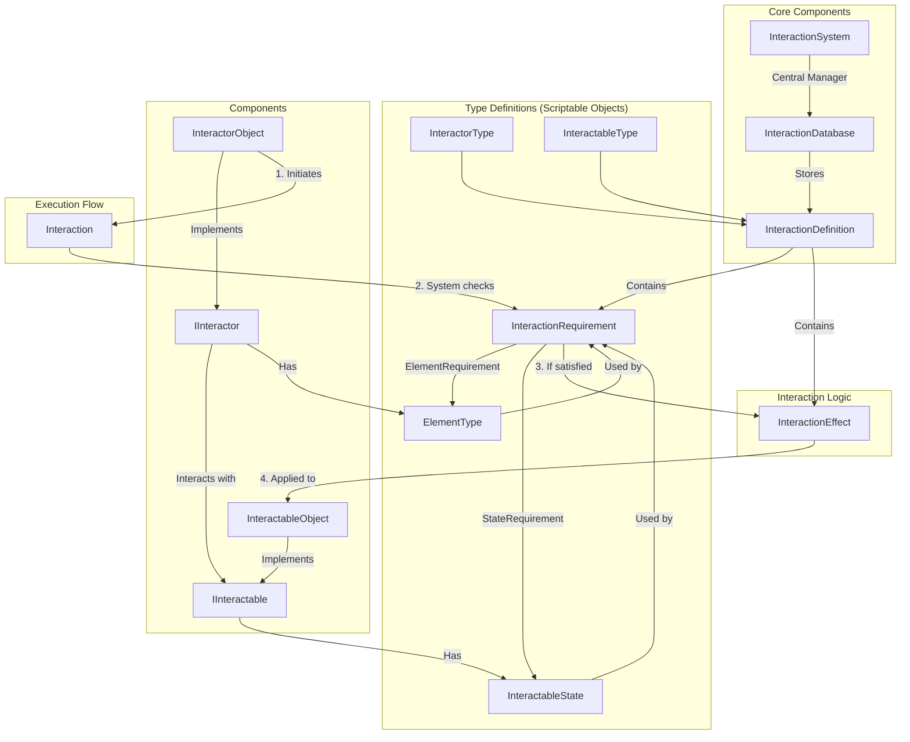

# Seyren Interaction System

**Version: 1.0.0**  
**Last Updated: April 16, 2025**

## Overview

The Interaction System in Seyren provides a flexible, data-driven approach to handle interactions between game objects. It defines what happens when two objects interact with each other, such as a player using a tool on an environment object, combining items, or triggering environmental changes.

## Architecture



## Core Components

### InteractionSystem

The central manager that processes all interactions in your game. It's implemented as a singleton that can be accessed via `InteractionSystem.Instance`.

```csharp
// Attempt an interaction between two objects
InteractionSystem.Instance.TryInteract(interactor, interactable);

// Get a preview of what would happen if these objects interact
InteractionPreview preview = InteractionSystem.Instance.GetInteractionPreview(interactor, interactable);
```

### InteractionDatabase

A ScriptableObject that stores all possible interactions in your game. It provides methods to find applicable interactions and manages the lookup table for quick interaction finding.

```csharp
// Create a new interaction database
[CreateAssetMenu(fileName = "MyInteractionDatabase", menuName = "Seyren/Interaction/Interaction Database")]
```

### Interfaces

#### IInteractor

Interface for objects that can initiate interactions:

```csharp
public interface IInteractor
{
    InteractorType GetInteractorType();
    IReadOnlyList<ElementType> GetElements();
    void OnInteractionPerformed(IInteractable target, InteractionDefinition interaction);
}
```

#### IInteractable

Interface for objects that can be interacted with:

```csharp
public interface IInteractable
{
    InteractableType GetInteractableType();
    IReadOnlyList<InteractableState> GetStates();
    void OnInteractedWith(IInteractor source, InteractionDefinition interaction);
}
```

## Type Definitions (ScriptableObjects)

### InteractorType

Defines a type of object that can initiate interactions (e.g., Player, Knife, Hoe).

### InteractableType

Defines a type of object that can be interacted with (e.g., Fruit, Land, Door).

### ElementType

Defines elemental properties that can affect interactions (e.g., Water, Fire, Ice).

### InteractableState

Defines a possible state for an interactable object (e.g., Cut, Wet, Locked).

## Interaction Definition

An InteractionDefinition ScriptableObject defines what happens when specific types of interactors interact with specific types of interactables. It includes:

- Interactor and interactable types
- Requirements that must be met for the interaction to occur
- Effects that happen when the interaction is performed
- Optional audio and visual feedback

```csharp
// Create a new interaction definition
[CreateAssetMenu(fileName = "CuttingInteraction", menuName = "Seyren/Interaction/Interaction Definition")]
```

## Requirements and Effects

### InteractionRequirement

Requirements are conditions that must be met for an interaction to occur. Built-in requirements include:

#### ElementRequirement

Requires the interactor to have specific elements:

```csharp
// Create a new element requirement
[CreateAssetMenu(fileName = "WaterElementRequirement", menuName = "Seyren/Interaction/Requirements/Element Requirement")]
```

#### StateRequirement

Requires the interactable to be in specific states (or not in certain states):

```csharp
// Create a new state requirement
[CreateAssetMenu(fileName = "NotCutStateRequirement", menuName = "Seyren/Interaction/Requirements/State Requirement")]
```

### InteractionEffect

Effects define what happens when an interaction occurs. Built-in effects include:

#### ChangeStateEffect

Changes the state of the interactable:

```csharp
// Create a new change state effect
[CreateAssetMenu(fileName = "AddWetStateEffect", menuName = "Seyren/Interaction/Effects/Change State Effect")]
```

#### SpawnObjectEffect

Spawns a new object as a result of the interaction:

```csharp
// Create a new spawn object effect
[CreateAssetMenu(fileName = "SpawnCutFruitEffect", menuName = "Seyren/Interaction/Effects/Spawn Object Effect")]
```

#### TransferElementEffect

Transfers elements from the interactor to the interactable:

```csharp
// Create a new transfer element effect
[CreateAssetMenu(fileName = "TransferWaterElementEffect", menuName = "Seyren/Interaction/Effects/Transfer Element Effect")]
```

## Implementation Components

### InteractorObject

A MonoBehaviour that implements the IInteractor interface:

```csharp
// Add this component to objects that can initiate interactions
[AddComponent(typeof(InteractorObject))]
```

Key features:
- Defines the type of interactor (InteractorType)
- Manages elements that the interactor can apply
- Controls interaction range and targeting
- Provides methods to find and interact with nearby interactables

### InteractableObject

A MonoBehaviour that implements the IInteractable interface:

```csharp
// Add this component to objects that can be interacted with
[AddComponent(typeof(InteractableObject))]
```

Key features:
- Defines the type of interactable (InteractableType)
- Manages states that the interactable can be in
- Can have elements attached to it
- Optional highlighting when interactable

## How to Set Up Interactions

### 1. Create Type Definitions

Start by creating the necessary ScriptableObjects to define your types:

1. Create InteractorTypes (e.g., Player, Tool)
2. Create InteractableTypes (e.g., Fruit, Door)
3. Create ElementTypes if needed (e.g., Water, Fire)
4. Create InteractableStates (e.g., Cut, Open)

### 2. Create Interaction Requirements and Effects

Define the conditions and outcomes of your interactions:

1. Create Requirements (e.g., ElementRequirement, StateRequirement)
2. Create Effects (e.g., ChangeStateEffect, SpawnObjectEffect)

### 3. Create Interaction Definitions

Combine types, requirements, and effects into complete interactions:

1. Create a new InteractionDefinition
2. Assign InteractorType and InteractableType
3. Add Requirements
4. Add Effects
5. Add optional audio/visual feedback

### 4. Add to Interaction Database

Create an InteractionDatabase and add all your interaction definitions to it.

### 5. Set Up GameObjects

1. Add InteractorObject component to objects that can initiate interactions
2. Add InteractableObject component to objects that can be interacted with

### 6. Initialize the InteractionSystem

Add the InteractionSystem to a scene and assign your InteractionDatabase.

## Example: Cutting a Fruit

### 1. Create Type Definitions

```csharp
// Create ScriptableObjects
var knifeType = CreateInstance<InteractorType>();
knifeType.name = "Knife";

var fruitType = CreateInstance<InteractableType>();
fruitType.name = "Fruit";

var cutState = CreateInstance<InteractableState>();
cutState.name = "Cut";
```

### 2. Create Requirements and Effects

```csharp
// Create a state requirement (fruit must not be cut already)
var notCutRequirement = CreateInstance<StateRequirement>();
notCutRequirement.name = "NotCutRequirement";
notCutRequirement.forbiddenStates = new List<InteractableState>() { cutState };

// Create a spawn effect (replace fruit with cut fruit)
var spawnCutFruitEffect = CreateInstance<SpawnObjectEffect>();
spawnCutFruitEffect.name = "SpawnCutFruitEffect";
spawnCutFruitEffect.objectToSpawn = cutFruitPrefab;
spawnCutFruitEffect.replaceInteractable = true;
```

### 3. Create Interaction Definition

```csharp
// Create the interaction definition
var cutFruitInteraction = CreateInstance<InteractionDefinition>();
cutFruitInteraction.name = "CutFruitInteraction";
cutFruitInteraction.interactorType = knifeType;
cutFruitInteraction.interactableType = fruitType;
cutFruitInteraction.requirements.Add(notCutRequirement);
cutFruitInteraction.effects.Add(spawnCutFruitEffect);
```

### 4. Set Up GameObjects

```csharp
// Knife GameObject
var knife = new GameObject("Knife");
var knifeInteractor = knife.AddComponent<InteractorObject>();
knifeInteractor.interactorType = knifeType;

// Fruit GameObject
var fruit = new GameObject("Fruit");
var fruitInteractable = fruit.AddComponent<InteractableObject>();
fruitInteractable.interactableType = fruitType;
```

### 5. Perform the Interaction

```csharp
// When player uses knife on fruit
if (InteractionSystem.Instance.TryInteract(knifeInteractor, fruitInteractable))
{
    Debug.Log("Fruit was cut!");
}
```

## Example: Elemental Tool on Land

This example shows how a hoe imbued with water can till land and make it wet:

### 1. Set Up Types

```csharp
var hoeType = CreateInstance<InteractorType>();
var landType = CreateInstance<InteractableType>();
var waterElement = CreateInstance<ElementType>();
var tillableState = CreateInstance<InteractableState>();
var wetState = CreateInstance<InteractableState>();
var tilledState = CreateInstance<InteractableState>();
```

### 2. Create Requirements and Effects

```csharp
// Land must be tillable
var tillableRequirement = CreateInstance<StateRequirement>();
tillableRequirement.requiredStates.Add(tillableState);

// Add effects
var addTilledStateEffect = CreateInstance<ChangeStateEffect>();
addTilledStateEffect.statesToAdd.Add(tilledState);

var addWetStateEffect = CreateInstance<ChangeStateEffect>();
addWetStateEffect.statesToAdd.Add(wetState);
```

### 3. Create Interaction Definition

```csharp
var tillLandInteraction = CreateInstance<InteractionDefinition>();
tillLandInteraction.interactorType = hoeType;
tillLandInteraction.interactableType = landType;
tillLandInteraction.requirements.Add(tillableRequirement);
tillLandInteraction.effects.Add(addTilledStateEffect);

// Optional: Only add wet state if hoe has water element
var waterRequirement = CreateInstance<ElementRequirement>();
waterRequirement.requiredElements.Add(waterElement);

if (hoeInteractor.GetElements().Contains(waterElement))
{
    tillLandInteraction.effects.Add(addWetStateEffect);
}
```

## Best Practices

### 1. Composition Over Inheritance

Use the existing requirements and effects to compose complex interactions rather than creating many specialized classes.

### 2. Use Previews

Implement UI feedback using the `GetInteractionPreview` method to show players what will happen before they perform an interaction.

### 3. Extend With Custom Components

For complex behaviors, you can extend `InteractorObject` and `InteractableObject` with custom implementations.

### 4. Organize Interactions

Group related interactions in separate databases to manage complexity in larger games.

## Extending the System

### Creating Custom Requirements

To create custom requirements, extend the `InteractionRequirement` class:

```csharp
[CreateAssetMenu(fileName = "MyCustomRequirement", menuName = "Seyren/Interaction/Requirements/Custom Requirement")]
public class MyCustomRequirement : InteractionRequirement
{
    public override bool IsSatisfied(IInteractor interactor, IInteractable interactable)
    {
        // Your custom logic here
        return true;
    }
}
```

### Creating Custom Effects

To create custom effects, extend the `InteractionEffect` class:

```csharp
[CreateAssetMenu(fileName = "MyCustomEffect", menuName = "Seyren/Interaction/Effects/Custom Effect")]
public class MyCustomEffect : InteractionEffect
{
    public override void ApplyEffect(IInteractor interactor, IInteractable interactable)
    {
        // Your custom logic here
    }
}
```

## Conclusion

The Seyren Interaction System provides a flexible framework for defining gameplay interactions without writing custom code for every scenario. By composing interactions from reusable requirements and effects, you can create a rich interactive world with minimal programming effort.
