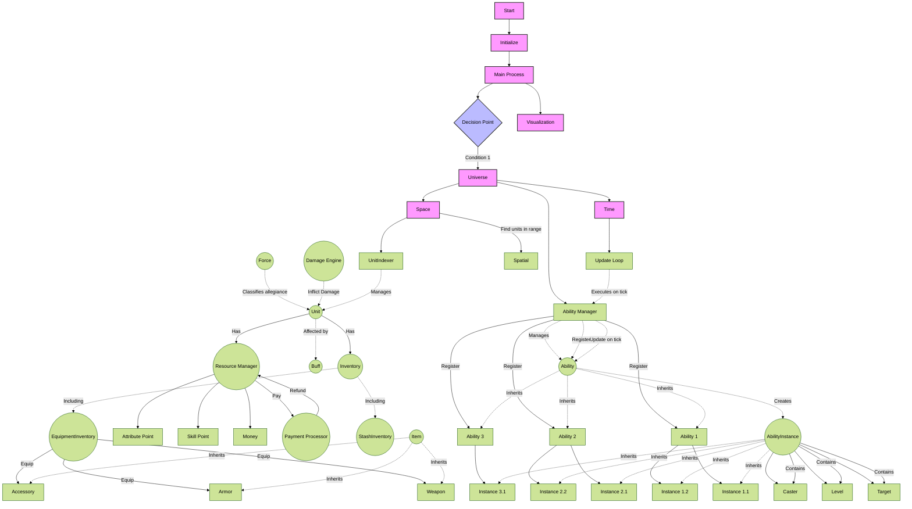
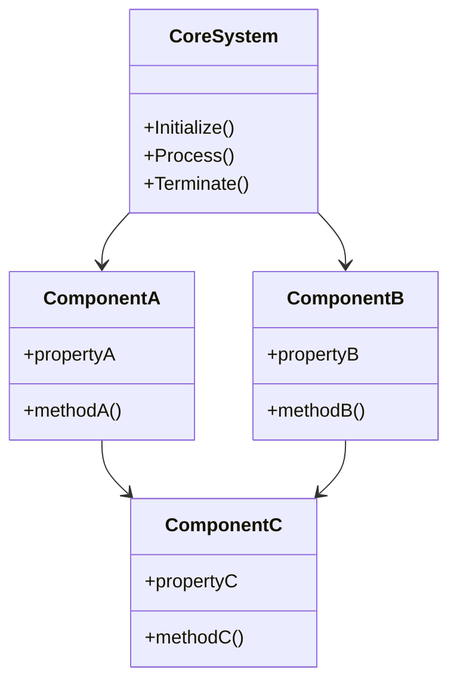
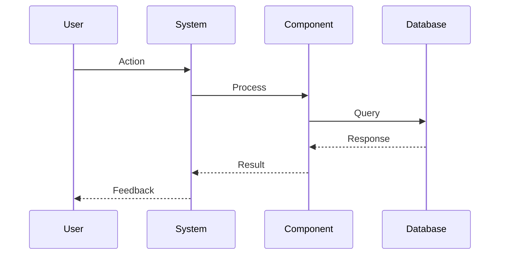
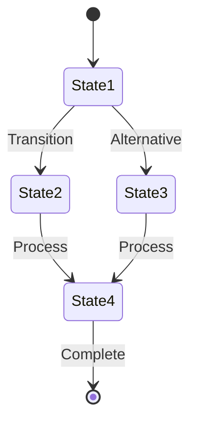

# Seyren Framework Overview

## System Architecture Flowchart



## Component Relationships



## Process Sequence



## State Transitions


stateDiagram-v2
    [*] --> State1
    State1 --> State2: Transition
    State1 --> State3: Alternative
    State2 --> State4: Process
    State3 --> State4: Process
    State4 --> [*]: Complete
```
    State1 --> State3: Alternative
    State2 --> State4: Process
    State3 --> State4: Process
    State4 --> [*]: Complete
```
    State2 --> State4: Process
    State3 --> State4: Process
    State4 --> [*]: Complete
```
