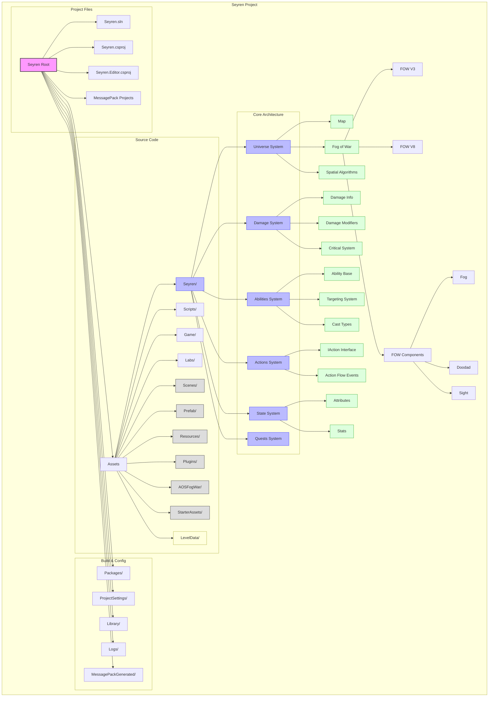

# Seyren Architecture

## Key Components

### Universe System
- **Map<TCell>**: Generic rectangular grid system for the game world
- **Fog of War**: Visibility system with multiple implementations (V3-V8)
- **Spatial Algorithms**: Includes QuadTree, OcTree for efficient spatial queries

### Damage System
- **Damage Info**: Core damage calculation and application
- **Modifiers**: System for modifying damage (criticals, reductions, etc.)
- **Critical System**: Handles critical hit mechanics

### Abilities System
- **Ability Base**: Foundation for character abilities
- **Targeting System**: Different targeting types (self, unit, point)
- **Cast Types**: Various casting behaviors (channel, active, instant, aura)

### Actions System
- **IAction Interface**: Contract for game actions with constraints
- **Action Flow**: Event-based flow management (start, break, end)

### State System
- **Attributes**: Character attributes with base and modified values
- **Stats**: Gameplay statistics tracking

## Design Patterns Used
- Entity Component System
- Observer Pattern
- Factory Pattern
- Pipeline Pattern
- Strategy Pattern