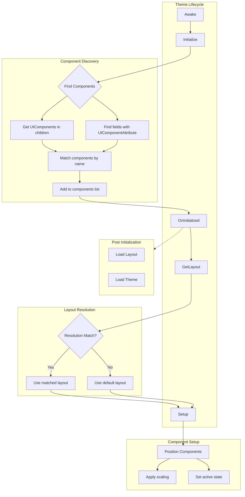

# Theme Process Pipeline

The Theme system in Seyren provides a structured approach for creating and managing UI layouts across different resolutions and device types.

## Process Flow

## Theme Implementation Steps

1. **Initialization**: The theme initializes by discovering all UI components in its children
2. **Layout Resolution**: The appropriate layout is selected based on current screen resolution
3. **Component Setup**: Each UI component is positioned and configured according to the layout
4. **Runtime Updates**: Components can be updated at runtime as needed

## Key Classes

- `Theme`: Abstract base class for all UI themes
- `UIResolutionConfig`: Contains layout configurations for different resolutions
- `UIResolutionLayout`: Defines component positions, scales, and states for a specific resolution
- `ComponentLayout`: Stores position, scale, and active state for a single component
- `DeviceResolutionMapper`: Maps device names to their screen resolutions
- `DeviceResolutionMapper`: Maps device names to their screen resolutions
